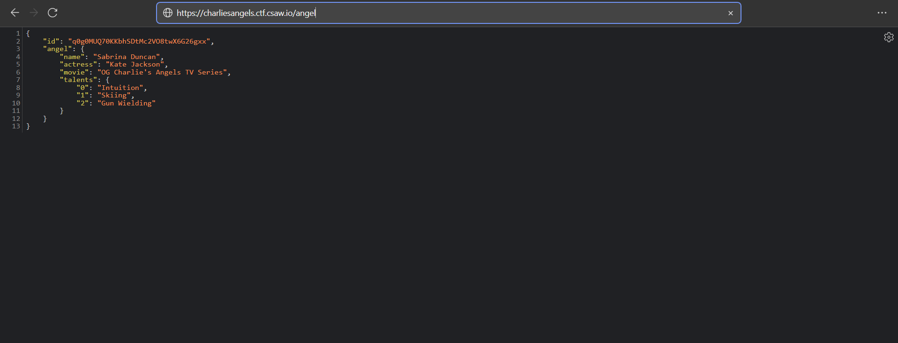
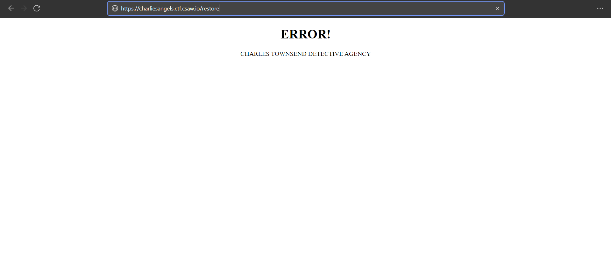
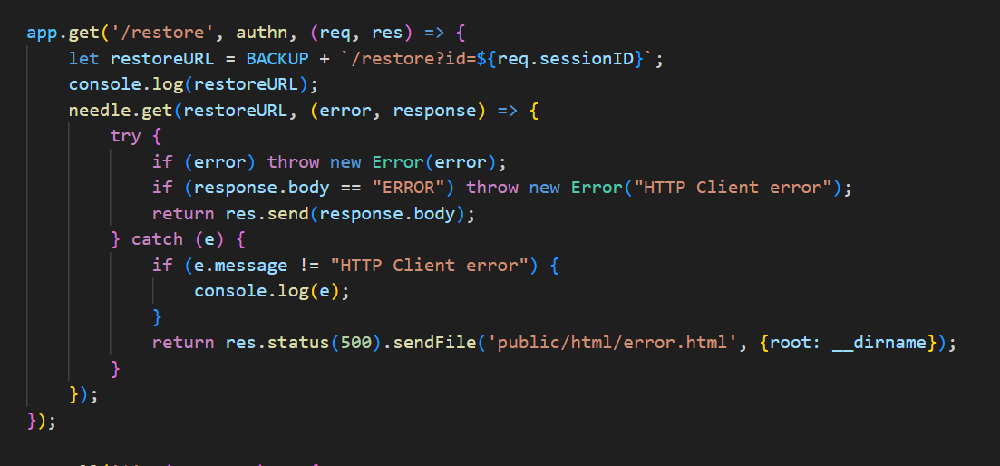
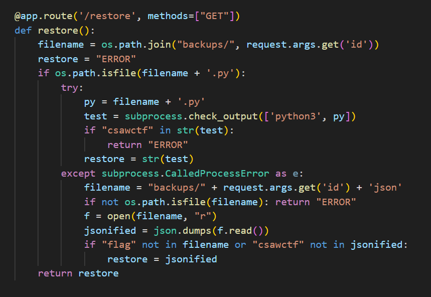
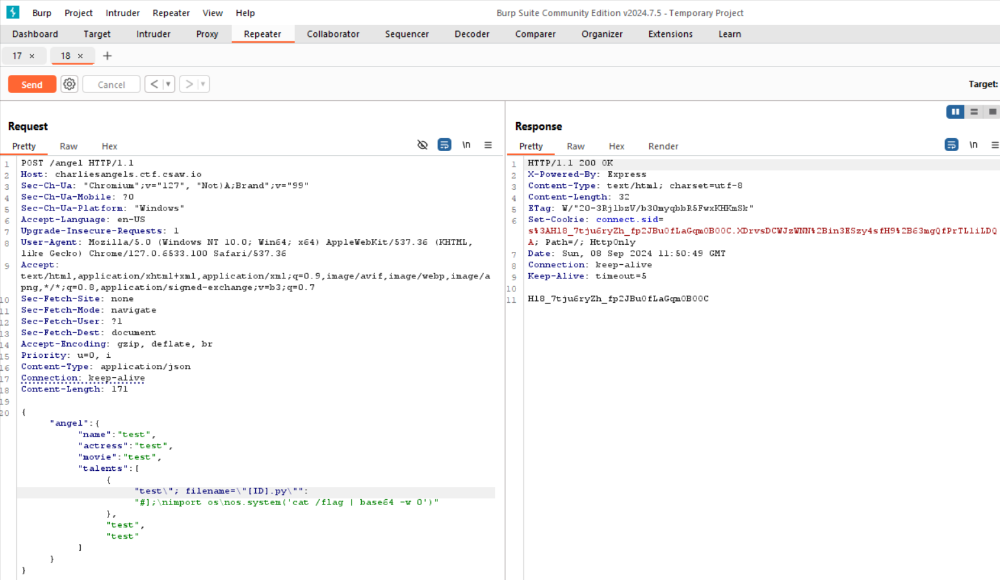
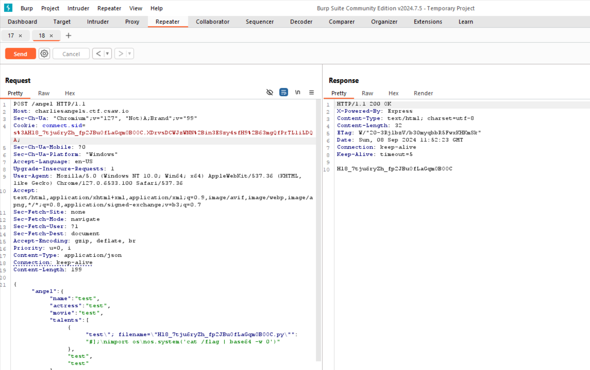
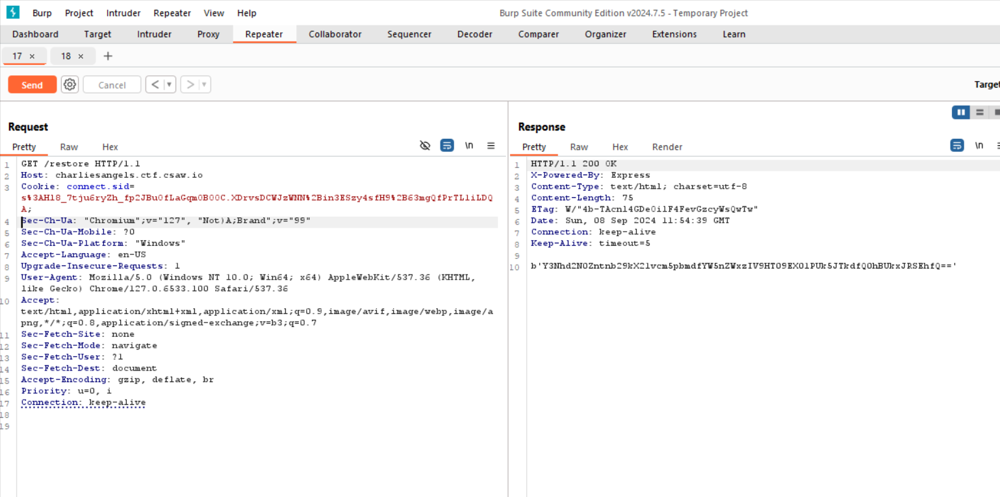
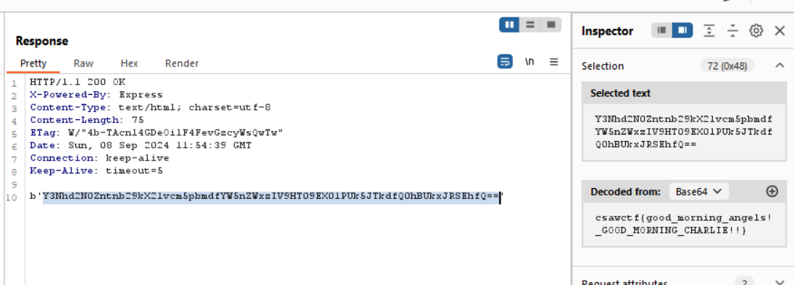

Challenge Description : The way that this franchise has fundamentally changed me...

- Enumeration 

The main page of the website has two links : 
1. UR ANGEL : Which redirects to the /angel endpoint and provides the details of a random female movie character and the actress who played it, in a JSON Format.

  
2. RESTORE AN ANGEL : This link redirects to the /restore endpoint, but throws an ERROR page.

Now moving on to the source codes,

The 'index.js' has the programs for /angel and /restore endpoints respectively. 

1. We can send a POST request to /angel endpoint in JSON format. Hence, we can try injecting a JSON payload.

  
2. Once the angel has been added to the server, we can access it through /restore endpoint using the SessionID (In Cookie)

In the backend code (app.py), we can see that, the filename is created using the ID received, once we upload a JSON document, with a .py (extension). Here, since the "talents" field of the JSON doesn't have any type validation, we can try injecting a Python payload and naming the file by ourselves.

- Exploitation

Let's use the Burpsuite Repeater for solving this challenge. Make sure to add the requests to /angel and /restore to the Repeater from HTTP History.

Step 1 : Make a POST request to /angel. Send this JSON payload :-

`{"angel":{"name":"test","actress":"test","movie":"test","talents":[{"test\"; filename=\"[ID].py\"":"#];\nimport os\nos.system('cat /flag | base64 -w 0')"},"test","test"]}}`

Make sure, to remove the cookie, so that the server generates a new SessionID for us. Also, add the Request Header "Content-Type: application/json

Step 2 : Now copy the SID generated in response and set it as the cookie in our request. Also, replace '[ID]' in our payload, with the ID generated in the response. Send this request again.

Step 3 : Finally, Copy the Cookie from our request to /angel and replace it with the Cookie in /restore request.

Step 4 : Finally, send the request to /restore. Notice the Base64 string in the response. On highlighting it, we get the Base64 decoded string on the right, which is our flag. The source code mentions that if the output contains the word "csawctf", it throws an error, hence, we first retrieve our flag in Base64 encoded format as output and then decode it to get the flag in plaintext.

`FLAG : csawctf{good_morning_angels!_GOOD_MORNING_CHARLIE!!}`
