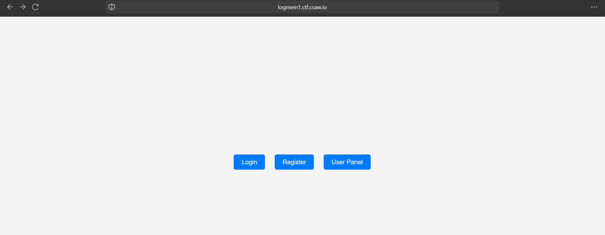
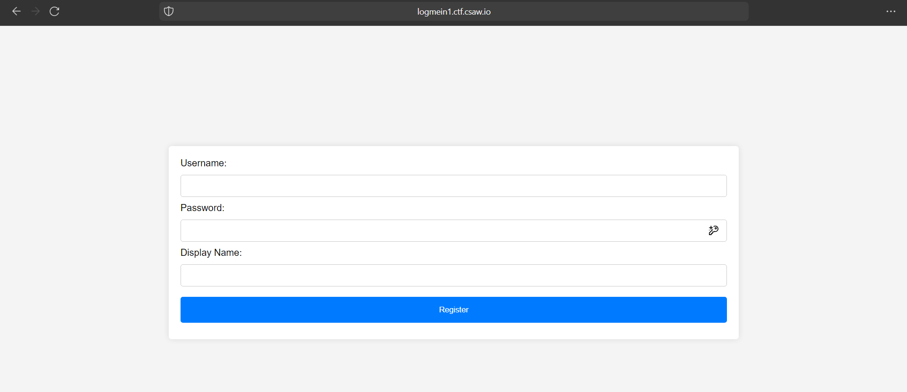
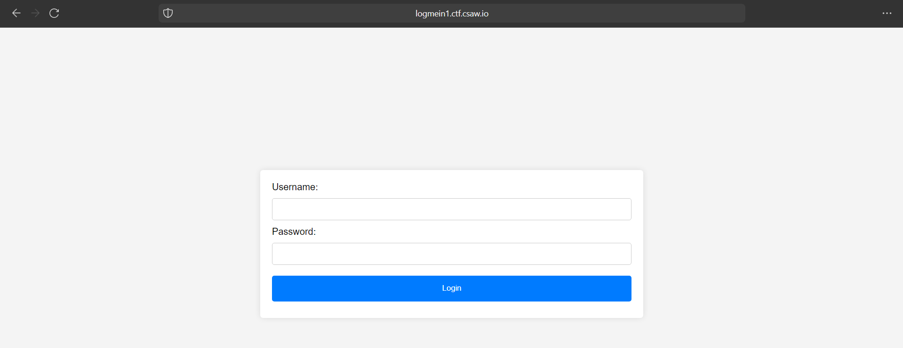
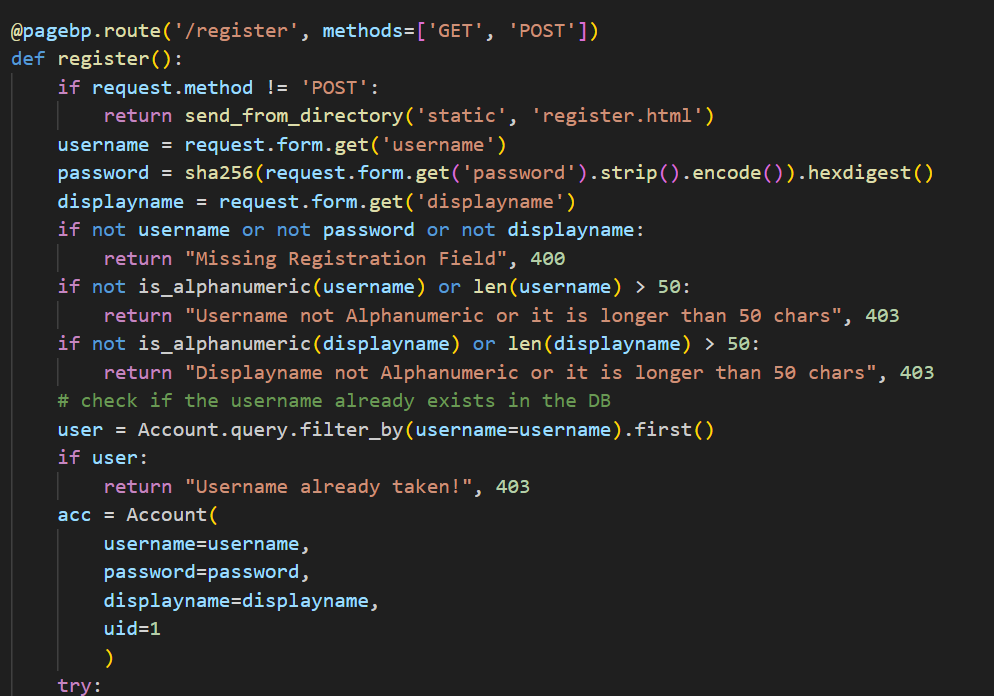
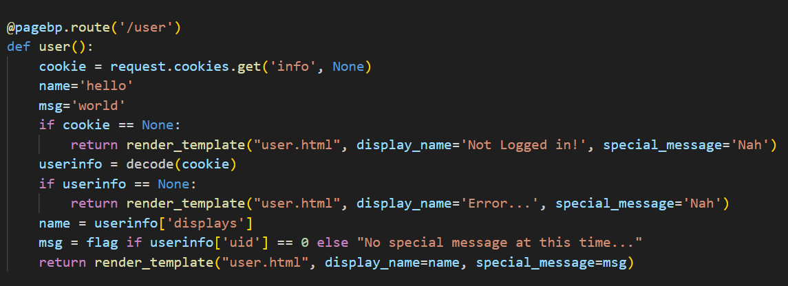
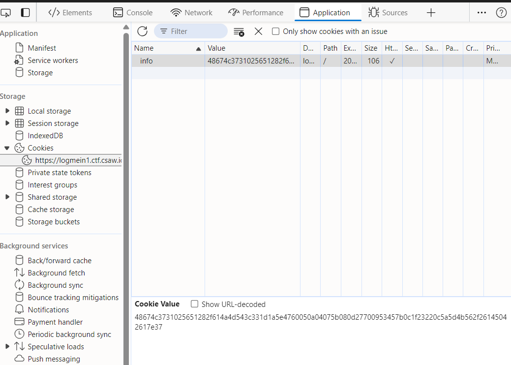
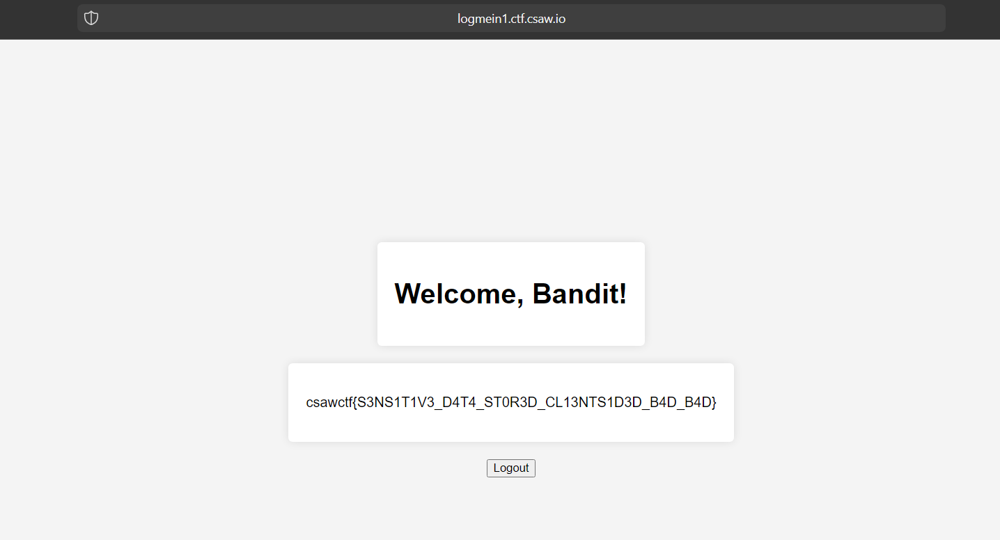

Challenge Description : I (definitely did not) have found this challenge in the OSIRIS recruit repository


- Enumeration 

The main page contains three options : Register, Login and User Panel.



The Register button takes us to the register page, where we can add a new user.



The Login button allows us to login as the registered user.



And the user panel displays stuff, only when we are logged in.

So, I registered a user and logged in with the account and landed on the 'User Panel' page. There are no redirections, hence, we have to manually access the endpoints via the URLs.


Now, it was time to scan through our Source Codes.

In the 'routes.py', the code for /login endpoint tells us that our info is first converted into a dictionary format and then encoded into a hexadecimal string using the 'encode' function and stored in the cookie. This function can be found in the 'utils.py'.


The code for /register endpoint tells us that each new user is assigned a uid value of "1" by default.



And finally, the code for /user endpoint tells us that the flag is displayed as message if our uid is set to "0".




- Exploitation

Since, we know that the cookie value is the output of the encode function in 'utils.py' and the input is our userinfo in dictionary format, I used a script which deciphers the key used for encryption. In Cryptography, this is called a "Known Plaintext Attack", in which we know the ciphertext and corresponding plaintext.

Here's the script I used :

```
import json
import binascii

# Provided dictionary
original_dict = {
    "username": "Your_Username",
    "displays": "Your_Displayname",
    "uid": 1
}

# Serialize and encode the dictionary to bytes
plaintext = json.dumps(original_dict).encode()

# Encoded output (cookie value) in hex
encoded_hex = "Copy the cookie value generated for you and paste it here."

# Convert hex to bytes
encoded_bytes = binascii.unhexlify(encoded_hex)

# Ensure the plaintext and encoded bytes are of the same length
if len(plaintext) != len(encoded_bytes):
    raise ValueError("Mismatch in length of plaintext and encoded bytes")

# Recover the key by XORing the plaintext and encoded bytes
key_bytes = bytes([pt_byte ^ enc_byte for pt_byte, enc_byte in zip(plaintext, encoded_bytes)])

# Print the recovered key
print("Recovered key:", key_bytes.decode())
```

On running the script using my credentials, I got the output :
`Recovered key: 3E9DTp80EJCpmvvRd8rgBacww7itTR3sg9mqGKxxqktZOprxANJ`

Now, we can use another script to generate the cookie we need, after setting the uid value to 0 in userinfo and using the key retrieved. Here's the script for generating the cookie :

```
import json
import binascii
import os

# Define the encode function
def encode(status: dict) -> str:
    try:
        plaintext = json.dumps(status).encode()
        out = b''
        for i, j in zip(plaintext, os.environ['ENCRYPT_KEY'].encode()):
            out += bytes([i ^ j])
        return bytes.hex(out)
    except Exception as s:
        print(s)
        return None

# Set the environment variable for the key
os.environ['ENCRYPT_KEY'] = 'Enter the key generated from 1st script'

# Modified dictionary
modified_dict = {
    "username": "Your username",
    "displays": "Your displayname",
    "uid": 0  # Changed value
}

# Encode the modified dictionary
encoded_output = encode(modified_dict)
print("Encoded output:", encoded_output)
```

On running this script with my credentials, I got the output : 
`Encoded output: 48674c3731025651282f614a4d543c331d1a5e4760050a04075b080d27700953457b0c1f23220c5a5d4b562f26145042617e37`

Finally, replace the cookie value generated by the website with this value and refresh the page, to get the flag.




`FLAG : csawctf{S3NS1T1V3_D4T4_ST0R3D_CL13NTS1D3D_B4D_B4D}`
